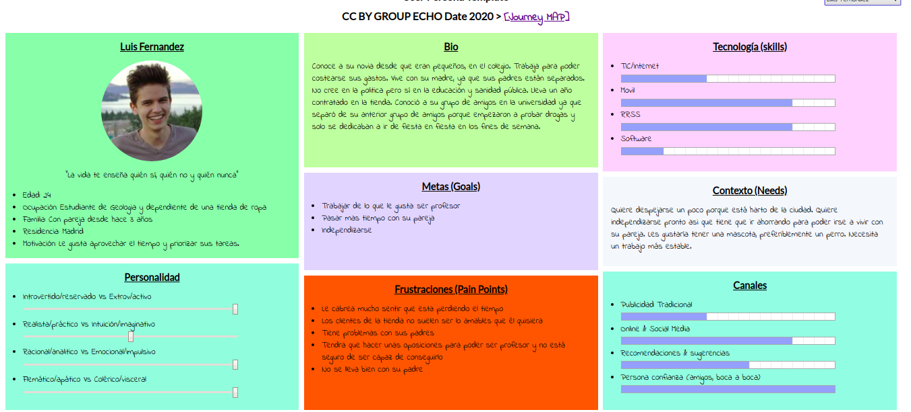
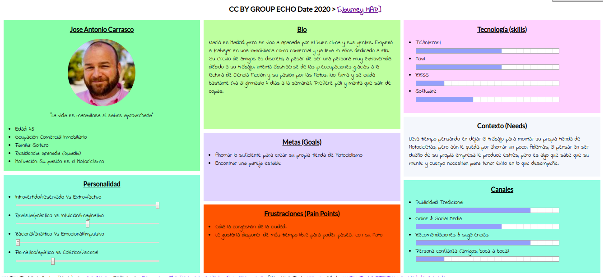

## DIU - Practica1, entregables

- __Desk research: Análisis Competencia__ 

Las aplicaciones o servicios seleccionados para realizar el estudio de usabilidad de esta práctica se basan en el concepto de economía colaborativa, que consiste en la puesta en común o intercambio de recursos en línea. Normalmente esto abarata los costes de los servicios que ofrece y además las interacciones son punto a punto. En estas aplicaciones el usuario es tanto demandante como ofertante. Ejemplo: BlaBlaCar, alguien oferta unas plazas en su coche y otro usuario decide comprarlas. En nuestro caso, asignado a nuestro grupo de prácticas, los servicios se enfocaban en la oferta de habitaciones/pisos para la estancia o alquiler de los mismos. 

Hemos elegido Habitoom debido a que es la que, a priori, parece la más pequeña de las recomendadas en el artículo de las mejores aplicaciones para buscar piso. Nos hemos basado en la usabilidad de la web, que solo tiene versión de escritorio. Si intentamos entrar con el móvil nos manda a la aplicación en la tienda o debemos usar dicha versión (de escritorio). La atención al cliente se hace a través de un número de Whatsapp. Todo esto hace que sea buena candidata para ser analizada.

A continuación, mostramos una tabla comparativa de funcionalidades entre ésta aplicación y las demás.

Escala: 1- Malo, 2- Moderado, 3- Bueno

|  	   | HomePage  | B y Filtros|Accesibil.  |Popularidad |
|---	   |---	       |---	    |---         |---	      |
| HABITOOM | 	2      |      2     |      1     |   	2     |
| BADI	   |   	3      |      3	    |      2     |   	3     |
| COMP.T.P | 	2      |      1	    |      1     |   	1     |   	   

- __Personas__ 

Luis Fernandez: Caso de una persona que ha tenido problemas con bastante personas, ha pasado toda la vida con su madre y la quiere mucho, pero cree que va llegando el momento de independizarse e irse a vivir con su novia, Paula. Es la persona con la que mejor se siente aunque también suele despejarse mucho con sus amigos. Si consigue un mejor trabajo le gustaría poder alquilar un piso medianamente bueno. También le gustaría realizar unos viajes para poder salir de Madrid, cosa que no ha hecho mucho más que con el colegio. Su profesión ideal sería ser profesor en el instituto de Geología, grado que está estudiando en este momento a la vez que trabaja en una tienda de ropa local.

Jose Antonio Carrasco: Caso de una persona de una edad más avanzada buscando piso para poder ahorrar algo más al mes. Suelen tardar más en decidir dónde vivir debido a experiencias anteriores, y no se conforman con cualquier cosa. A pesar de sus exigencias, en muchas ocasiones deben ceder y resignarse a compartir un piso aunque su objetivo fuera vivir solos. 
Jose vive en Granada y trabaja en un inmobiliaria en la que dedica gran parte de su tiempo. Podríamos decir que es un loco por el trabajo y muy responsable en el mismo. No tiene muchos amigos, prefiere peli y manta que salir de copas y le apasiona el mundo del motor. Su sueño es montar su propia tienda de Motos. Se cuida bastante, va al gimnasio que está en la calle donde vive y su poco tiempo libre lo emplea en recoletar información sobre administración de empresas para cuando monte su negocio.

- __User Journey Map__

Experiencia de Luis Fernandez: esta experiencia es muy factible que se produzca debido a la ausencia de atención que genera "Contactar con el propietario" al estar en el mismo color que el resto de la página. Sería más recomendable destacarlo más. Es posible que el usuario se encuentre buscando de arriba a abajo e incluso haciendo scrolls para encontrar "un botón" como podría ser el de Booking. 

Experiencia de Jose Antonio Carrasco: esta experiencia es bastante común cada vez más, personas con una cierta edad que no disponen de los medios necesarios para poder independizarse por completo y deciden pasar una temporada compartiendo piso para poder ahorrar. En éste caso la experiencia acaba siendo satisfactoria. Los problemas encontrados por Jose Antonio fueron los pocos filtros de búsqueda en la Web, que permiten personalizar muy poco las búsquedas, dando lugar a resultados no deseados. 

- __Revisión de Usabilidad__ 

Nos encontramos ante una Web de alquiler de pisos compartidos (Habitaciones) en el contexto de *Economía colaborativa*. La valoración numérica final obtenida en la plantilla de revisión de usabilidad deja que desear debido a varios problemas de diseño encontrados en la web, el principal de ellos debido a una sección de búsquedas y filtros muy compacta que no ayuda al usuario a entender cómo interaccionar con ella, haciendo que primero deba estudiar la web para entender dónde *clickar* y cómo llevar a cabo las búsquedas. 

Además, carece de formularios de contacto suficientes para solicitar información o ayuda, aunque dispone de una sección de *FAQs* bien elaborada pero difícil de localizar. 
En nuestra opinión tiene mucho margen de mejora en cuanto al diseño (Principalmente el diseño en *caja* hace que la web sea muy compacta y difícilmente entendible por el usuario, además de no ser soportada por dispositivos móviles, cosa que sólo por ello debería considerarse un craso error de accesibilidad)

