## DIU - Practica2, entregables

- __Malla receptora de información__   

De cara a realizar un mejor diseño del estudiado en la P1, hemos de empezar realizando una malla receptora de información (feedback capture grid), en la que vamos a obtener un *feedback* sobre el diseño analizado, así como lanzar nuevas propuestas e ideas para el desarrollo de los bocetos de nuestra App. 

Es importante tener en cuenta que estamos realizando un Diseño Centrado en el Usuario, que sitúa a la persona como eje principal del proceso de diseño, por lo que gran parte de los contenidos de la malla receptora harán referencia a problemas/sugerencias que los usuarios (nuestras personas) hayan podido tener.   

#### Caso estudiado: HABITOOM        

   
 

Como podemos observar en el FeedBack capture grid, hemos destacado todas aquellas inquietudes que han podido surgir a nuestros usuarios. Destacamos en críticas constructivas, la falta de filtros de búsqueda avanzados y personalizados, así como el diseño de la interfaz tan colapsada que consigue abrumar al usuario. 

En cuanto a las ideas/propuestas de valor para un nuevo diseño de la plataforma, destacamos la creación de una sección de búsqueda guidada paso a paso para el usuario, la inclusión de Chats directos con el propietario, chat directo con el servicio técnico de la plataforma, Búsqueda por zona y Suscripción a alertas personalizadas. 

La sección de búsqueda guiada permitiría al usuario desentenderse de tener que pulsar tantos botones sobre la interfaz para realizar el filtro, así como dar una sensación de obtención de viviendas con características mucho más personalizas. El usuario sería guiado por una especie de formulario por pasos ("Step by step form") en el que garantizaríamos búsquedas más concretas de acuerdo a las preferencias del mismo. 

El principal problema de ésta propuesta podría llegar a ser la impaciencia del usuario por terminar el formulario, aunque es áltamente recomendable para personas que no tengan tanto control con las nuevas tecnologías, hacíendole el camino más ameno y simple. 

 - __User/task Matrix__   

En ésta sección vamos a definir el User/task matrix. Una matriz o tabla en la que vamos a enumerar cada una de las funcionalidades que nuestro diseño va a soportar, y vamos a compararla con los distintos perfiles de usuario que harían uso de la app, para poder destacar las funcionalidades más relevantes a la hora de plantear un diseño, y hacer hincapié en las mismas.

Hemos optado por realizar el User/task matrix en lugar del User task/flow porque creemos que refleja la importancia de las funcionalidades de un simple vistazo, obteniendo una visión completa de lo que debemos diseñar de cara a obtener un diseño mucho más cercano a la realidad. 

En contraposición, el User/task flow presenta una visión particular de los pasos que debe usar el usuario para realizar una tarea concreta, lo que serviría mucho a los diseñadores para llevar a cabo el diseño y programación de la app.   

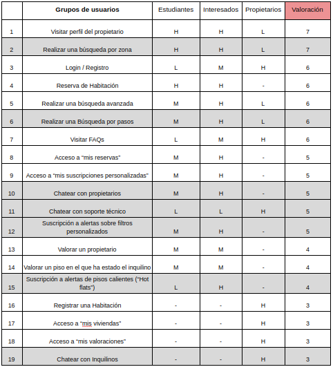   

Hemos usado la métrica siguiente para numerar y dar un valor a las distintas funcionalidades de nuestra App: 

 - "-" -> 0
 - "L" -> 1
 - "M" -> 2
 - "H" -> 3

Obtenemos así una tabla con las funcionalidades ordenadas según frecuencia de uso y segúń el tipo de usuario que haga uso de ellas.

Como se puede observar, la frecuencia de uso (H,M,L) varía según el perfil de usuario analizado.

Obtenemos una frecuencia de uso menor respecto a los propietarios en aquellas "nuevas" funcionalidades que hemos incorporado, muestra de nuestro "diseño centrado en el usuario", siendo éste un usuario que busca compartir piso y no un propietario. 

En cuanto a las nuevas funcionalidades incorporadas, destacamos:
 - "Realizar búsqueda por pasos": Funcionalidad que puede que no cale tanto en el perfil de los estudiantes, pero sí en el de interesados generales, que pueden llegar a ser personas con un menor conocimiento de las tecnologías y que vean en ésta funcionalidad una mejor opción para no perderse con tantos filtros en la búsqueda avanzada. 
 - "Chatear con propietario e inquilino" : Funcionalidad que pretende dar dinamismo a la comunicación entre las personas involucradas, quitando el tedioso formulario de contacto. 
 - "Búsqueda por zona": donde el usuario podrá seleccionar con una herramienta de "lazo" la zona en la que desea alquilar habitación
 - "Suscripción a alertas sobre filtros personalizados": Permite recibir alertas en función de una búsqueda que hayamos realizado, asegurando así que la opción final escogida cumpla con nuestros criterios.

Destacamos finalmente que los usuarios "Interesados" (personas con una cierta experiencia ya en la vida, no estudiantes ó con trabajos ya fijos, más serios), harán más uso de las funcionalidades planteadas, mientras que los usuarios "Estudiantes" irán más al grano, sin tener en cuenta tantos filtros ni preferencias. 

 - __Sitemap__   

Para describir la navegación lógica de nuestra App, hemos desarrollado un Sitemap ó mapa del sitio por el que el usuario podrá navegar. 

Para ello, hemos tenido en cuenta todas las funcionalidades nuevas añadidas, así como las existentes.    

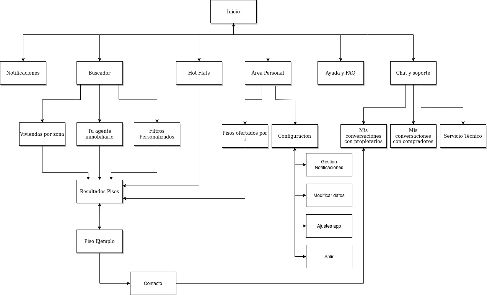   

 - __Labelling__   

Para poder entender el Sitemap anterior, hemos de describir cada uno de los "labels" ó etiquetas que lo conforman, y por las que el usuario podrá navegar.

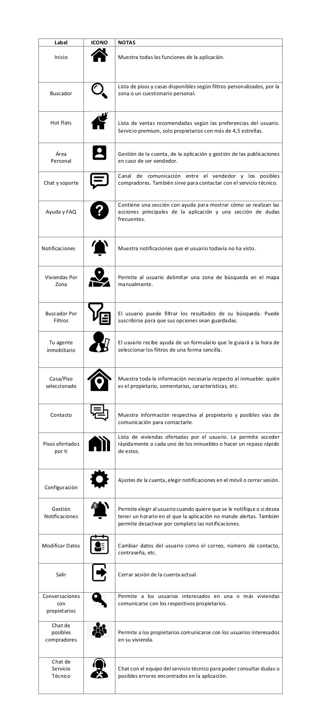   

 - __Wirfeframes__   

Finalmente, hemos desarrollado multitud de wireframes correspondientes a cada uno de las vistas que se podría encontrar el usuario al hacer uso de nuestra app, siguiendo el esquema del sitemap y labelling anteriormente desarrollados. 

<figure>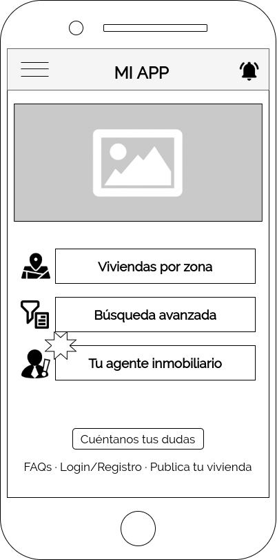<figcaption>Inicio</figcaption></figure>&nbsp; &nbsp;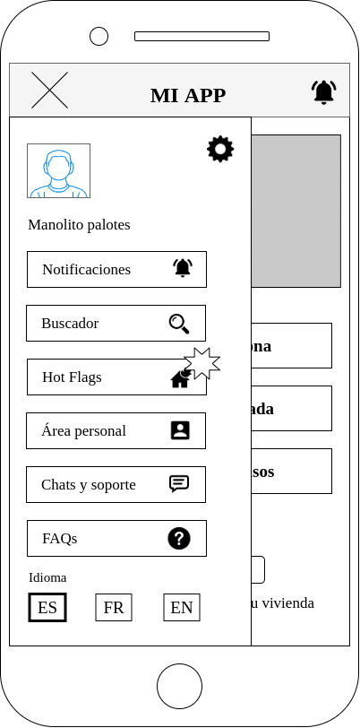&nbsp; &nbsp;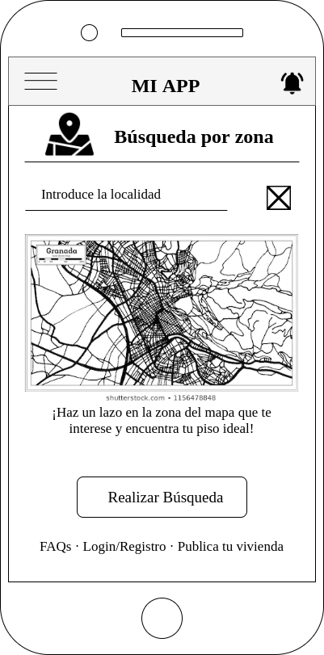

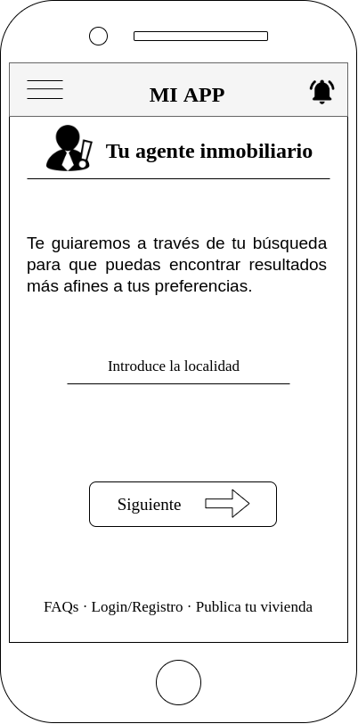&nbsp; &nbsp;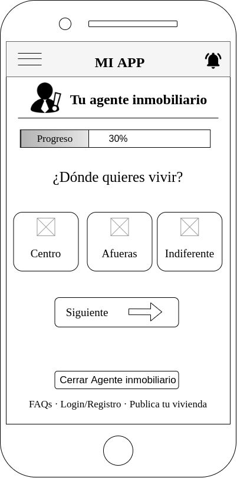&nbsp; &nbsp;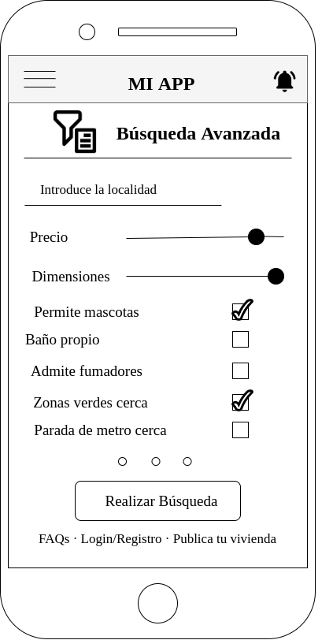

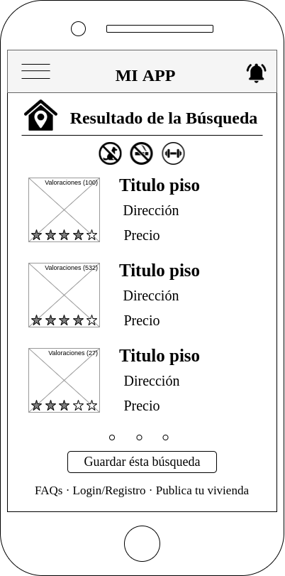&nbsp; &nbsp;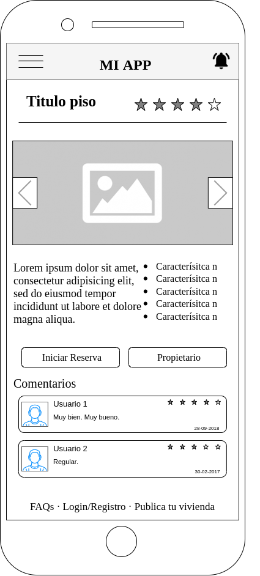&nbsp; &nbsp;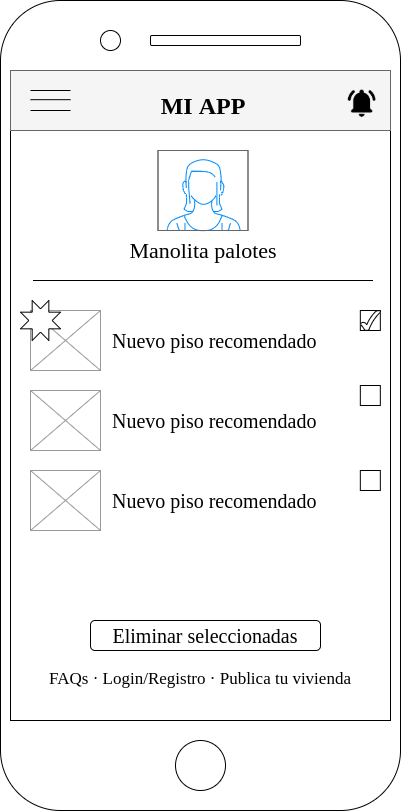

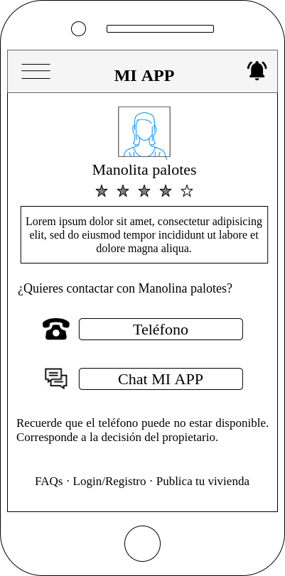&nbsp; &nbsp;&nbsp; &nbsp;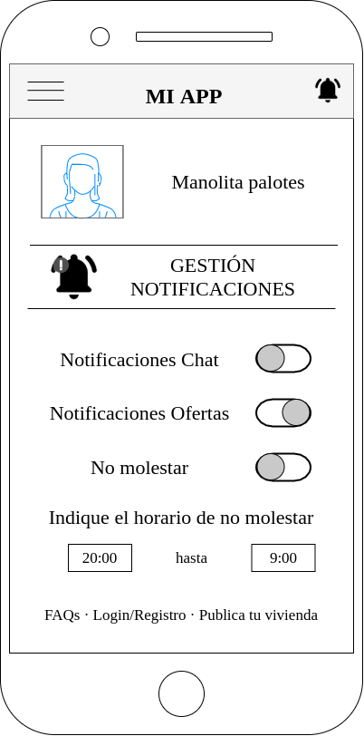

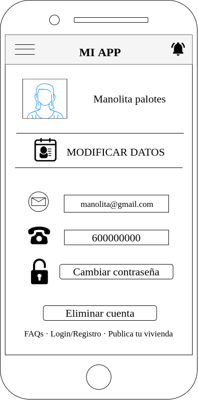&nbsp; &nbsp;&nbsp; &nbsp;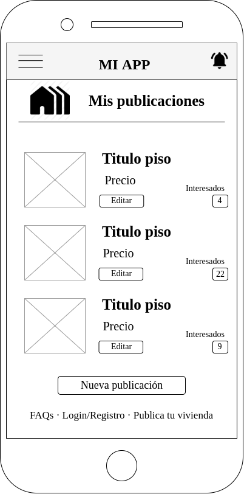

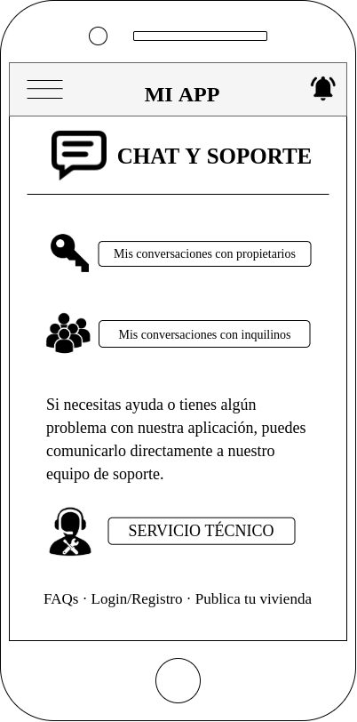&nbsp; &nbsp;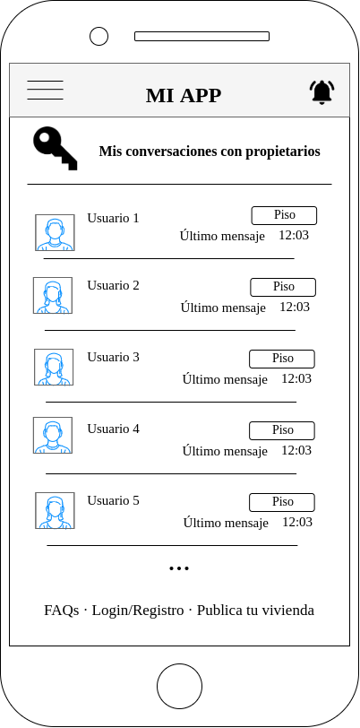&nbsp; &nbsp;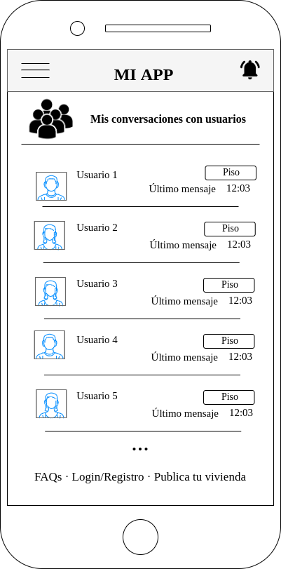

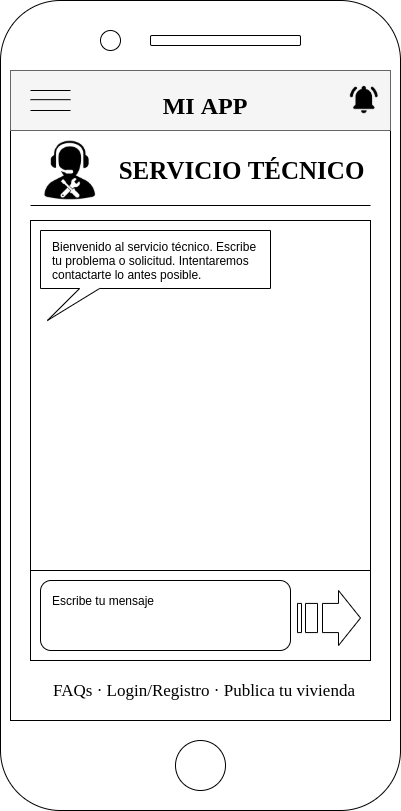&nbsp; &nbsp;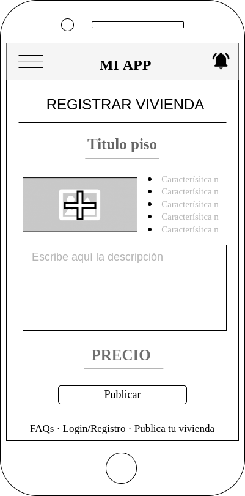&nbsp; &nbsp;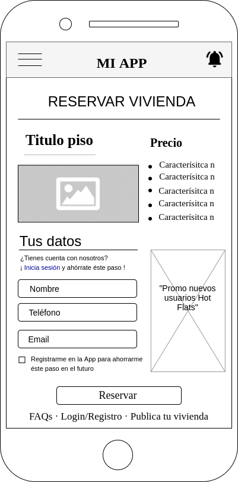

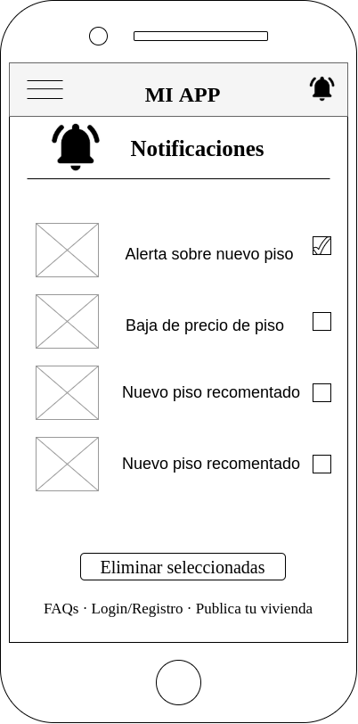

