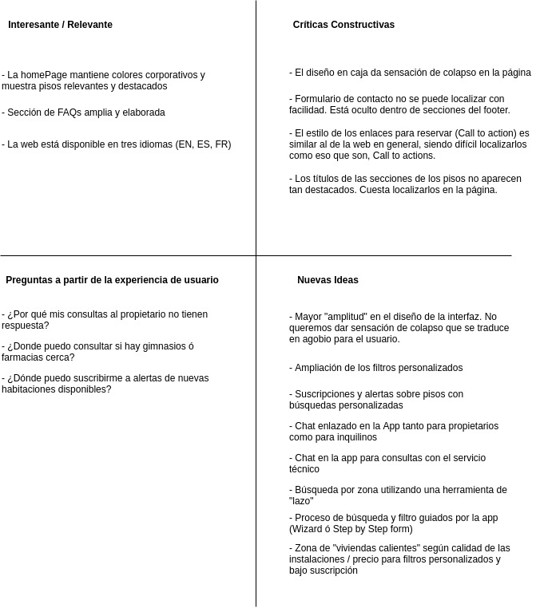

## DIU - Practica2, entregables

- __Malla receptora de información__

De cara a realizar un mejor diseño del estudiado en la P1, hemos de empezar realizando una malla receptora de información (feedback capture grid), en la que vamos a obtener un *feedback* sobre el diseño analizado, así como lanzar nuevas propuestas e ideas para el desarrollo de los bocetos de nuestra App. 

Es importante tener en cuenta que estamos realizando un Diseño Centrado en el Usuario, que sitúa a la persona como eje principal del proceso de diseño, por lo que gran parte de los contenidos de la malla receptora harán referencia a problemas/sugerencias que los usuarios (nuestras personas) hayan podido tener.

### Caso estudiado: HABITOOM

 

Como podemos observar en el FeedBack capture grid, hemos destacado todas aquellas inquietudes que han podido surgir a nuestros usuarios. Destacamos en críticas constructivas, la falta de filtros de búsqueda avanzados y personalizados, así como el diseño de la interfaz tan colapsada que consigue abrumar al usuario. 

En cuanto a las ideas/propuestas de valor para un nuevo diseño de la plataforma, destacamos la creación de una sección de búsqueda guidada paso a paso para el usuario, así como la inclusión de Chats directos con el propietario. 

La sección de búsqueda guiada permitiría al usuario desentenderse de tener que pulsar tantos botones sobre la interfaz para realizar el filtro, así como dar una sensación de obtención de viviendas con características mucho más personalizas. El usuario sería guiado por una especie de formulario por pasos ("Step by step form") en el que garantizaríamos búsquedas más concretas de acuerdo a las preferencias del mismo. 

El principal problema de ésta propuesta podría llegar a ser la impaciencia del usuario por terminar el formulario, aunque es áltamente recomendable para personas que no tengan tanto control con las nuevas tecnologías, hacíendole el caminio más ameno y simple. 

 - __User/task Matrix__

Sitemap & Task flow 
Labelling 
Wireframe & User flow 
