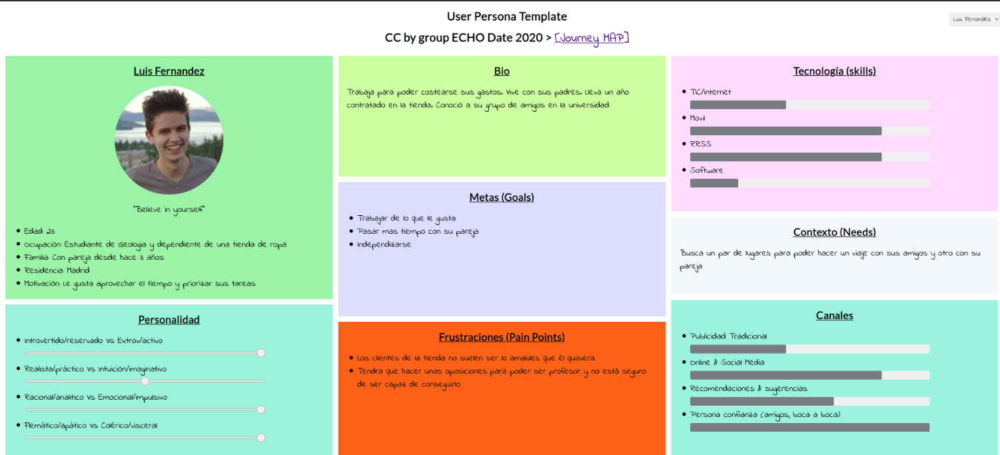
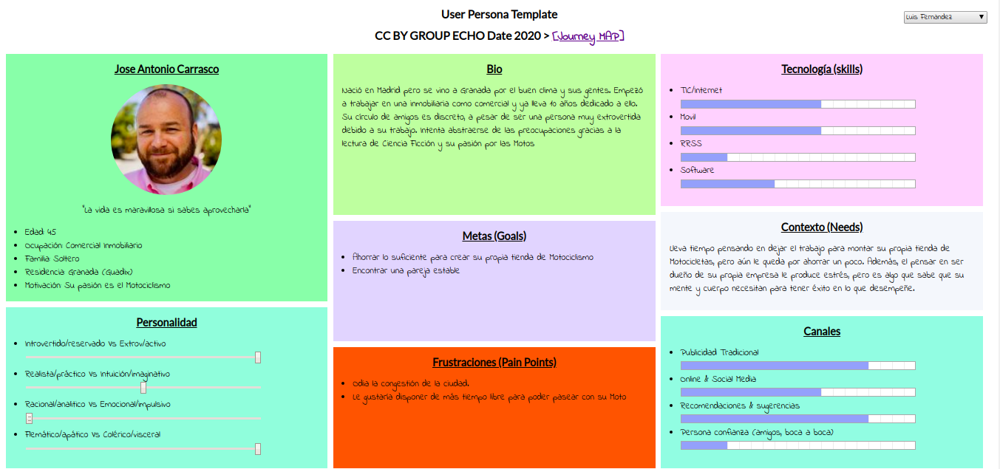
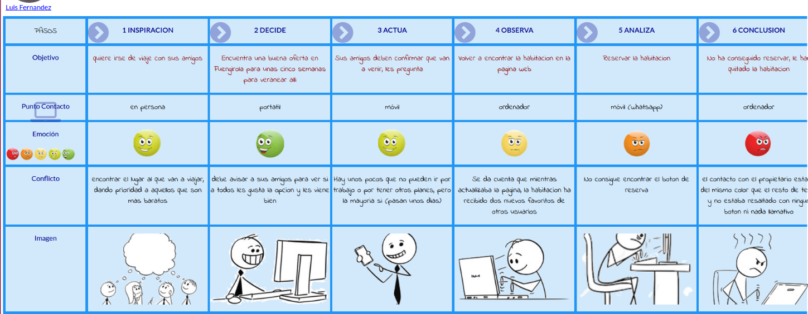
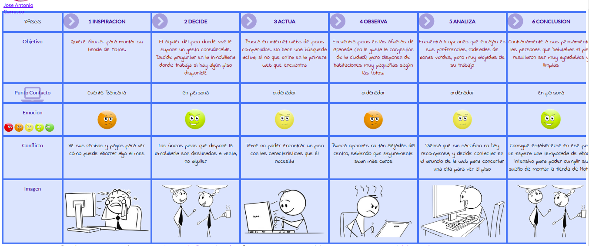

# DIU20
Prácticas Diseño Interfaces de Usuario 2019-20 (Economía Colaborativa) 

Grupo: DIU2_ECHO.  Curso: 2019/20 

Proyecto: 

Descripción: 

Logotipo: 

Miembros
 * :bust_in_silhouette:  Manuel Pancorbo Castro    :octocat: [manuelpcastro](https://github.com/manuelpcastro)
 * :bust_in_silhouette:  Domingo López Pacheco     :octocat: [DomingoLopez](https://github.com/DomingoLopez)

----- 

En esta práctica estudiaremos un caso de plataforma de economía colaborativa y realizaremos una propuesta para su diseño Web/movil. Utilizaremos herramientas y entregables descritos en el siguiente CheckList (https://github.com/mgea/UX-DIU-Checklist) 

Qué es economia colaborativa: Martínez-Polo, J. (2019). **El fenómeno del consumo colaborativo: del intercambio de bienes y servicios a la economía de las plataformas**, *Sphera Publica, 1*(19), 24-46. http://sphera.ucam.edu/index.php/sphera-01/article/view/363/14141434

# Proceso de Diseño 

## Paso 1. UX Desk Research & Analisis 

 1.a Competitive Analysis
-----

Las aplicaciones o servicios seleccionados para realizar el estudio de usabilidad de esta práctica se basan en el concepto de economía colaborativa, que consiste en la puesta en común o intercambio de recursos en línea. Normalmente esto abarata los costes de los servicios que ofrece y además las interacciones son punto a punto. En estas aplicaciones el usuario es tanto demandante como ofertante. Ejemplo: BlaBlaCar, alguien oferta unas plazas en su coche y otro usuario decide comprarlas. En nuestro caso, asignado a nuestro grupo de prácticas, los servicios se enfocaban en la oferta de habitaciones/pisos para la estancia o alquiler de los mismos. 

Hemos elegido Habitoom debido a que es la que, a priori, parece la más pequeña de las recomendadas en el artículo de las mejores aplicaciones para buscar piso. Nos hemos basado en la usabilidad de la web, que solo tiene versión de escritorio. Si intentamos entrar con el móvil nos manda a la aplicación en la tienda o debemos usar dicha versión (de escritorio). La atención al cliente se hace a través de un número de Whatsapp. Todo esto hace que sea buena candidata para ser analizada.

 1.b Persona
-----

Luis Fernandez: los jóvenes son los usuarios más activos en este tipo de aplicaciones debido a que normalmente estos tienen bajo presupuesto. Dejan de lado, por ejemplo, ir a una agencia de viajes para que se lo realicen. Prefieren tener más poder a la hora de decidir y buscar lo que más se ajusta a ellos. Luis quiere viajar con sus amigos o su pareja en verano y Habitoon puede ser una buena opción para encontrar un sitio en el que hospedarse.

Jose Antonio Carrasco: Caso de una persona de una edad más avanzada buscando piso para poder ahorrar algo más al mes. Suelen tardar más en decidir dónde vivir debido a experiencias anteriores, y no se conforman con cualquier cosa. A pesar de sus exigencias, en muchas ocasiones deben ceder y resignarse a compartir un piso aunque su objetivo fuera vivir solos. Jose Antonio necesita ahorrar para montar su propia tienda de Motos y cumplir su sueño. 

 1.c User Journey Map
----

Experiencia de Luis Fernandez: esta experiencia es muy factible que se produzca debido a la ausencia de atención que genera "Contactar con el propietario" al estar en el mismo color que el resto de la página. Sería más recomendable destacarlo más. Es posible que el usuario se encuentre buscando de arriba a abajo e incluso haciendo scrolls para encontrar "un botón" como podría ser el de Booking. 

Experiencia de Jose Antonio Carrasco: esta experiencia es bastante común cada vez más, personas con una cierta edad que no disponen de los medios necesarios para poder independizarse por completo y deciden pasar una temporada compartiendo piso para poder ahorrar. En éste caso la experiencia acaba siendo satisfactoria. Los problemas encontrados por Jose Antonio fueron los pocos filtros de búsqueda en la Web, que permiten personalizar muy poco las búsquedas, dando lugar a resultados no deseados. 

 1.d Usability Review
----
Revisión de Usabilidad: HABITOOM

 - [Enlace al documento pdf - UsabilityReview-P1](P1/Usability-review-template-P1.pdf)
 - Valoración final: 60 - Moderate
 - Comentario sobre la valoración:

	Nos encontramos ante una Web de alquiler de pisos compartidos (Habitaciones) en el contexto de *Economía colaborativa*. La valoración numérica final deja que desear debido a varios problemas de diseño encontrados en la web, el principal de ellos debido a una sección de búsquedas y filtros muy compacta que no ayuda al usuario a entender cómo interaccionar con ella, haciendo que primero deba estudiar la web para entender dónde *clickar* y cómo llevar a cabo las búsquedas. 
Además, carece de formularios de contacto suficientes para solicitar información o ayuda, aunque dispone de una sección de *FAQs* bien elaborada pero difícil de localizar. 
En nuestra opinión tiene mucho margen de mejora en cuanto al diseño (Principalmente el diseño en *caja* hace que la web sea muy compacta y difícilmente entendible por el usuario, además de no ser soportada por dispositivos móviles, cosa que sólo por ello debería considerarse un craso error de accesibilidad)

## Paso 2. UX Design  

 2.a Feedback Capture Grid
----

>>> Comenta con un diagrama los aspectos más destacados a modo de conclusion de la práctica anterior,

 Interesante | Críticas     
| ------------- | -------
  Preguntas | Nuevas ideas
  
  
  
>>> ¿Que planteas como "propuesta de valor" para un nuevo diseño de aplicación para economia colaborativa ?
>>> Problema e hipótesis
>>>  Que planteas como "propuesta de valor" para un nuevo diseño de aplicación para economia colaborativa te
>>> (150-200 caracteres)

 2.b Tasks & Sitemap 
-----

>>> Definir "User Map" y "Task Flow" ... 

 2.c Labelling 
----

>>> Identificar términos para diálogo con usuario  

Término | Significado     
| ------------- | -------
  Login¿?  | acceder a plataforma

 2.d Wireframes
-----

>>> Plantear el  diseño del layout para Web/movil (organización y simulación ) 

## Paso 3. Make (Prototyping) 

 3.a Moodboard
-----

>>> Plantear Diseño visual con una guía de estilos visual (moodboard) 

  3.b Landing Page
----

>>> Plantear Landing Page 

 3.c Guidelines
----

>>> Estudio de Guidelines y Patrones IU a usar 

  3.d Mockup
----

>>> Layout: Mockup / prototipo HTML  (que permita simular tareas con estilo de IU seleccionado)

## Paso 4. UX Check (Usability Testing) 

 4.a A/B Testing
----

>>> Comprobacion de asignaciones para A/B Testing. Asignaciones https://github.com/mgea/DIU19/blob/master/ABtesting.md

>>>> Práctica A: 

 4.b User Testing
----

>>> Usuarios para evaluar prácticas 

| Usuarios | Sexo/Edad     | Ocupación   |  Exp.TIC    | Personalidad | Plataforma | TestA/B
| ------------- | -------- | ----------- | ----------- | -----------  | ---------- | ----
| User1's name  | H / 18   | Estudiante  | Media       | Introvertido | Web.       | A 
| User2's name  | H / 18   | Estudiante  | Media       | Timido       | Web        | A 
| User3's name  | M / 35   | Abogado     | Baja        | Emocional    | móvil      | B 
| User4's name  | H / 18   | Estudiante  | Media       | Racional     | Web        | B 

. 4.c Cuestionario SUS
----

>>> Usaremos el **Cuestionario SUS** para valorar la satisfacción de cada usuario con el diseño (A/B) realizado. Para ello usamos la [hoja de cálculo](https://github.com/mgea/DIU19/blob/master/Cuestionario%20SUS%20DIU.xlsx) para calcular resultados sigiendo las pautas para usar la escala SUS e interpretar los resultados
http://usabilitygeek.com/how-to-use-the-system-usability-scale-sus-to-evaluate-the-usability-of-your-website/)
Para más información, consultar aquí sobre la [metodología SUS](https://cui.unige.ch/isi/icle-wiki/_media/ipm:test-suschapt.pdf)

>>> Adjuntar captura de imagen con los resultados + Valoración personal 

 4.c Usability Report
----

>> Añadir report de usabilidad para práctica B 

## Paso 5. Evaluación de Accesibilidad  

  5.a Accesibility evaluation Report
----

>>> Indica qué pretendes evaluar (de accesibilidad) y qué resultados has obtenido + Valoración personal

>>> Evaluación de la Accesibilidad (con simuladores o verificación de WACG) 

## Conclusión / Valoración de las prácticas

>>> (90-150 caracteres) Opinión del proceso de desarrollo de diseño siguiendo metodología UX y valoración (positiva /negativa) de los resultados obtenidos  

